# Инструкция по работе с Git 
## *Начальная работа с системой контроля версий*

## 1. Инициализация

**1.1. Создаем папку Instruction на рабочем столе**

**1.2. Открываем папку Instruction в VisualStudioCode**

**1.3. Создаем файл Instruction.md (можно через командную строку терминала):**

        echo "# текст" >>Instruction.md
**1.4. Создаем локальный репозиторий:**

        git init

## 2. Создаем коммит

**2.1. Добавляем файл проекта в локальном репозитории (выбрать всё):**

        git add . 
**2.2. Создаем коммит:**

        git commit -m "Initial Commit"

## 3. Основные команды

**git init** - создать локальный репозиторий

**git status** - проверить текущее состояние файла

**git add .** - добавить файлу версию в локальном репозитории

**git commit -m "Message"** - создать коммит (фиксация изменений в файле)

**git log** - вывод истории коммитов в хронологическом порядке

**git diff** - вывод изменений на текущий момент по отношению к последнему коммиту

**git checkout master** либо **git checkout хэш-номер коммита** -  переход между изменениями либо возврат к текущему состоянию

## 4. Процесс работы с Git

В процессе написания кода для сохранения изменений в файле периодически делаем commit. 

Для этого:

**4.1. Сохраняем изменения (Ctrl-S)**

**4.2. Проверяем статус:**

    git status

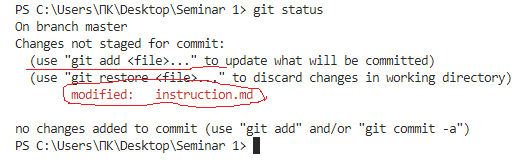

**4.3. Добавляем версию:**

    git add .

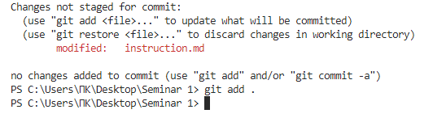

**4.4. Создаем коммит:**

    git commit -m "Имя коммита"

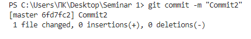

**4.5. Снова проверяем статус:**

    git status  

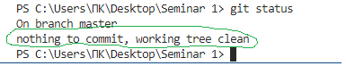

**4.6. Просматриваем лог:**

    git log

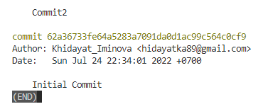

**4.7. При необходимости можно перейти на более ранний коммит:**

    git checout 62a36

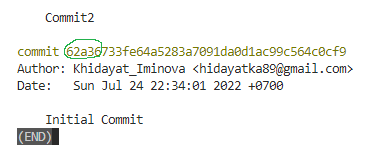

и обратно:

    git master

## 5. Цитаты, картинки и ссылки

**5.1. Для того, чтобы вставить цитату**

Находим цитату ) и вставляем:

> *(с) Здесь должна быть чья-то очень умная цитата*

**5.2. Для того, чтобы добавить картинку:** 

Находим картинку, копируем в папку с репозиторием (в данном случае это Seminar 1), и пишем:

    ![имя картинки] (image.png)

**5.3. Для того, чтобы добавить ссылку необходимо написать:**

    [Текст ссылки]: URL-адрес

Например:

    [Яндекс]: http://yandex.ru

[Яндекс]: http://yandex.ru

и прописать в тексте:

    [Яндекс]

В результате на экран будет выведена гиперссылка:

[Яндекс]

## 6. Ветки

**6.1. Создание веток**

Ветку можно создать двумя способами:

*1-й способ:*

    git checkout -b <имя ветки>

   флаг -b означает "создать ветку", т.е. создаем и сразу же переходим на созданную ветку

*2-й способ:*

    git branch <имя ветки>

   создаем новую ветку, при этом оставаясь в той же ветке, что и раньше

**6.2. Слияние веток**

> **(!) Перед слиянием веток необходимо убедиться, что все изменения сохранены (!)** 

Слияние веток выполняется при помощи команды git merge <имя ветки>.
    Например, если нужно добавить к ветке **_master_** ветку **_part_6_**, необходимо:
    
перейти на ветку **_master_** (git checkout master)

    git branch master

   выполнить слияние
        
    git merge part_6

**6.3. Удаление ветки**

Удаление ветки можно произвести двумя способами

_1-й способ:_
        
    git branch -d <имя ветки>

использование флага **_-d_** позволяет произвести безопасное удаление ветки. Удаление происходит в том случае, если ранее уже было произведено слияние с основной веткой.

   _2-й способ:_
        
    git branch -D <имя ветки>

использование флага **_-D_** позволяет произвести принудительное (форсированное) удаление ветки. Удаление происходит в любом случае.

**6.4. Проверка работы флагов.** 

+ перейдем на ветку **_master_**
* выполним удаление через флаг **_-d_**

        
        git branch -d part_6
                

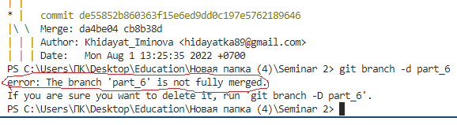

Git указывает, что для ветки part_6 еще не было слияния и удалять ее отказывается.

## 7. Конфликты

При слиянии веток может возникнуть конфликт, например если содержимое в одних и тех же строках веток отличается друг от друга.

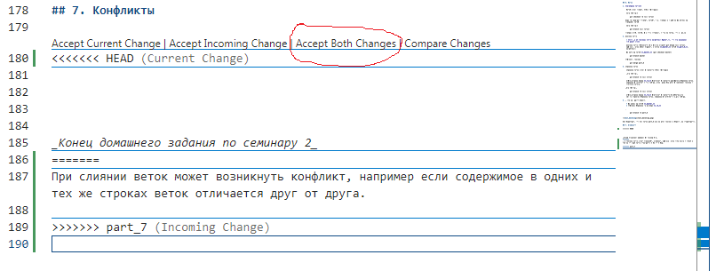

В данном случае принимаем оба варианта и корректируем вручную.

После устранения конфликта сохраняем изменения и создаем коммит.

## 8. Работа с удаленным репозиторием 

 **8.1. GitHub**

GitHub.com - сервис для удаленной работы с репозиториями

* регистрируемся (**Sign Up**)

* авторизуемся (**Sign In**)

**8.2. Создать новый репозиторий на GitHub**

Для того, чтобы создать новый репозиторий необходимо нажать кнопку NEW.

Открывается страница Create a New Repository

Заполняем форму:

- **Repository name** - имя репозитория (например clone_check)
- **Description** - описание репозитория (необязательно)
- **Public/Private** - соответственно открытый/приватный доступ к репозиторию
- **Add a README file** - ставим галочку

Что-нибудь пишем в файле README.md

После внесения изменений в README.md создаем commit (кнопка внизу **commit changes**)

**8.3. Чтобы клонировать репозиторий на локальный компьютер:**

- кнопка **Code** ---> копировать ссылку в буфер (нажать 2 квадратика справа от ссылки)

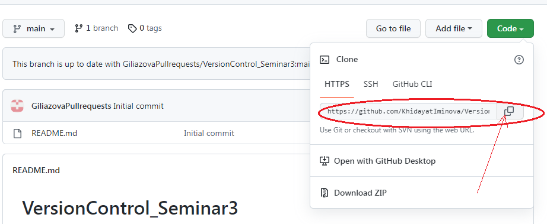

- создать папку на рабочем столе (например Seminar 3)

- Открыть папку в VSCode (**не выполнять git init!**)

>Перед выполнением **git clone** выполнить **git status** - убедиться, что в папке нет репозитория

- выполнить git clone URL-адрес ссылки (вставка из буфера правой кнопкой мышки)

в папке Seminar 3 появится папка с репозиторием **clone_check**

>NOTE: при попытке выполнения git status будет ошибка, т.к. мы находимся в папке Seminar 3, а там репозитория нет. Для работы с репозиторием 
clone_check необходимо выполнить смену директории на clone_check (**cd clone_check**)

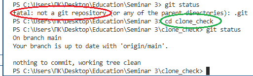

**8.4. Чтобы удалить репозиторий из Github:**

Заходим в **Settings** (настройки репозитория - не путать с настройками профиля) 

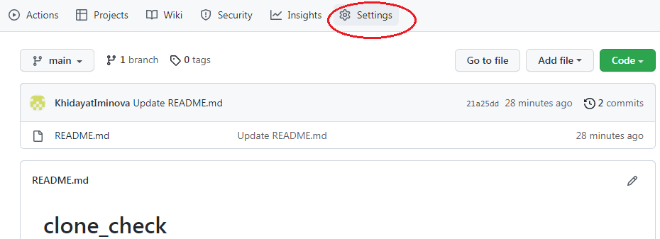

нажимаем кнопку в самом низу **Delete this repositiry**

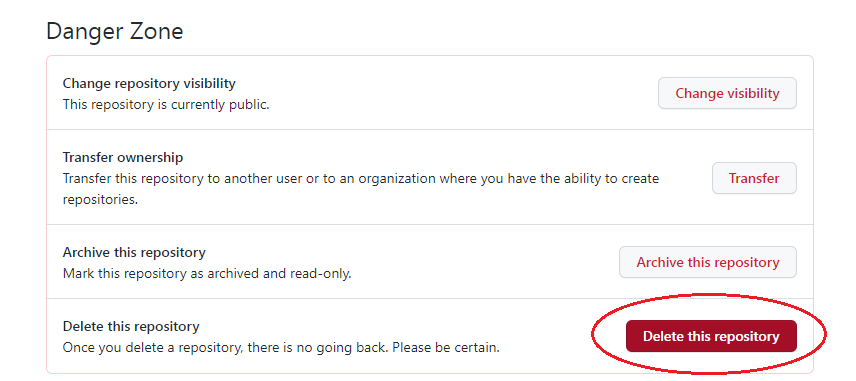

**8.5. Команды Push/Pull**

- Создаем новую папку на рабочем столе (например **Seminar 3_1**)

- Открываем ёё в VSCode

- выполняем **git init**

- создаем файл **README.md**

- что-нибудь пишем, сохраняем/добавдяем/коммитим 

Переходим на GitHub.com:

* Создаем новый репозиторий (кнопка **NEW**). В открывшемся окне **Create a New Repository** заполняем форму:

    - **Repository name** - имя репозитория
    - **Description** - описание репозитория (необязательно)
    - **Public/Private** - соответственно открытый/приватный доступ к репозиторию
    - **Add a README file** -   файл не добавляем, поэтому ***галочку не ставим!***

* Нажимаем кнопку Create. Открывается окно подсказок

* копируем в буфер подсказки из...or push an existing......и вставляем в VSCode:

        git remote add origin https://github.com/KhidayatIminova/test-3.git  

  *присваиваем URL-адресу на репозиторий test-3 обозначение **origin***

      git branch -M main

  *главную ветку называем **main** (так принято). Теперь если выполнить git branch, то вместо ветки **master** будет  ветка **main***

      git push -u origin main

  *отправляем ветку **main** на **origin** (где **origin** это URL-адрес репозитория test-3 на Github (см.выше))*

Переходим на GitHub - теперь там отображается обновленный репозиторий **test-3** с изменениями

Теперь, допустим возникла необходимость поработать с репозиторием непосредственно в Github, через браузер:

   Вносим изменения, делаем коммит (кнопка commit changes)

Потом, когда уже добираемся до своего компъютера с VSCode делаем **git pull**

    git pull

выполняется merge версии GitHub и локальной версии (если были изменения также и в локальной версии, то с конфликтом)

сохраняемся, коммитим, делаем git push (теперь уже можно -u origin main не прописывать)

    git push

*...и так перекидываться из VSCode в GitHub и обратно можно до бесконечности...*

**8.6. Fork удаленного репозитория (система pull request)**

>**Fork** – удаленная копия репозитория на сервере, отличающаяся от оригинала

Удаленная копия репозитория делается если, к примеру, хочется поучаствовать в open-source проекте и предложить свои изменения: 

1. Делаем fork интересующего нас проекта
2. Через кнопку CODE копируем в буфер URL ссылки
3. Делаем git clone для нашей версии этого репозитория
3. Создаем ветку с предлагаемыми изменениями
4. Производим все изменения только в этой ветке
5. Отправляем эти изменения на свой аккаунт (push)
6. В окне на GitHub появляется возможность отправить pull reqest (нажать кнопку)

Для того, чтобы выполнить fork необходимо найти нужный репозиторий на GitHub ---> **вкладка fork** ---> **create new fork**

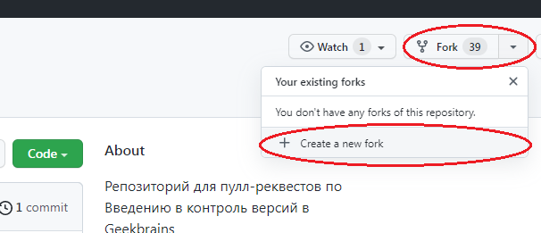

>Примечание: fork возможен только для чужого репозитория

Создаем новую папку на рабочем столе, открываем ее в VSCode, **git init** **не выполняем**

>Перед выполнением **git clone** выполнить **git status** - убедиться, что в папке нет репозитория

Делаем git clone URL(fork):

    git clone https://github.com/KhidayatIminova/VersionControl_Seminar3.git

и смену директории:

    cd VersionControl_Seminar3

Смотрим ветки

    git branch

Создаем ветку для pull request

    git checkout -b Iminova_Seminar_3  

Создаем файл **Instruction.md**. Вносим изменения, сохраняем, коммитим.

Выполняем git push

    git push

Пишет, что такой ветки в удаленном репозитории нет

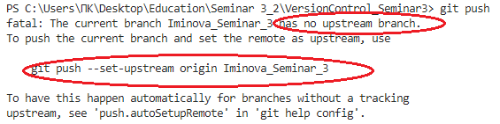

и предлагает выполнить команду **git push --set-upstream origin Iminova_Seminar_3**  - выполняем:

    git push --set-upstream origin Iminova_Seminar_3

В удаленном репозитории на github появляется сообщение что есть изменения и кнопка **Compare&Pull reqest**  - жмём

потом жмём **create Pull Request**

Pull Request отправлен

*Конец домашнего задания по семинару 3*

