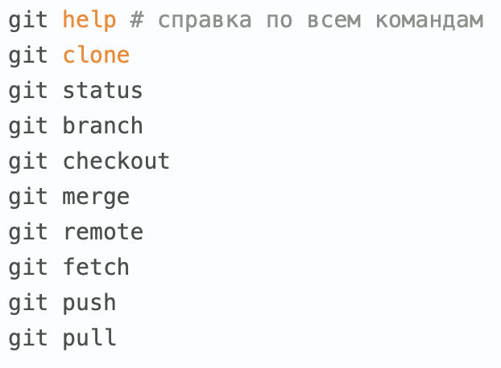

# Инструкция по работе с Git
 
 ## Начальная работа с системой контроля версий

 *git --version* - команда для проверки версии git

 *git init* - инициализируем пустой репозиторий

 *git status* - проверяем текущее положение файлов

 *git add* - добавляем версионность файлу

 *git commit -m "Message"* - Команда для фиксации изменений файла

 *git log* - вывод истории коммитов в хронологическом порядке
 
*git diff* - вывод изменений на текущий момент по отношению к последнему коммиту

*git checkout master либо хеш-номер коммита* - переход между изменениями, либо возврат к текущему состоянию

>Перед началом работы с git, ему надо представиться

*git config --global user.name "<ваше_имя>"*

*git config --global user.email "<адрес_почты@email.com>"*

[Тренажёр по Git](https://learngitbranching.js.org/)

Пока хватит :) Команды на будущее на изображении ниже:

## Что такое Git?

Git - это одна из реализаций распределённых систем контроля версий, имеющая как локальные, так и удалённые репозитории. Является самой популярной реализацией систем контроля версий. 

## Подготовка репозитория

Для создания репозитория необходимо выполнить команду *git init* в папке с репозиторием.

## git add

Для добавления изменений используем команду *git add*. Чтобы использовать git add, напишите *git add <имя файла>*.

## Создание коммитов

Для того чтобы создать коммит (сохранение), необходимо выполнить команду *git commit -m "Сообщение"*.

## Создание ветки

Для того чтобы создать ветку, необходимо использовать команду *git branch <имя ветки>* или *git checkout -b <имя ветки>*.

## Обновляем локальную ветку с сервера
git pull origin master

## Отправляем изменения в репозиторий
git push origin master

## Cкачать проект из репозитория
git clone <адрес_репозитория>

## Объединение текущей ветки, с указанной
git merge <название_ветки>

## Что такое Fork
Форк - это копия репозитория. Разветвление репозитория позволяет вам свободно экспериментировать с изменениями, не затрагивая исходный проект.

## git fetch
Когда вы используете git fetch, вы добавляете изменения из удаленного репозитория в свою локальную рабочую ветку, не фиксируя их. В отличие от git pull, fetch позволяет вам просматривать изменения перед их фиксацией в вашей локальной ветке.

## squash
Чтобы объединить несколько коммитов в один коммит. Также команда Git.

[Ещё больше информации здесь](https://docs.github.com/en/get-started/quickstart/github-glossary)
