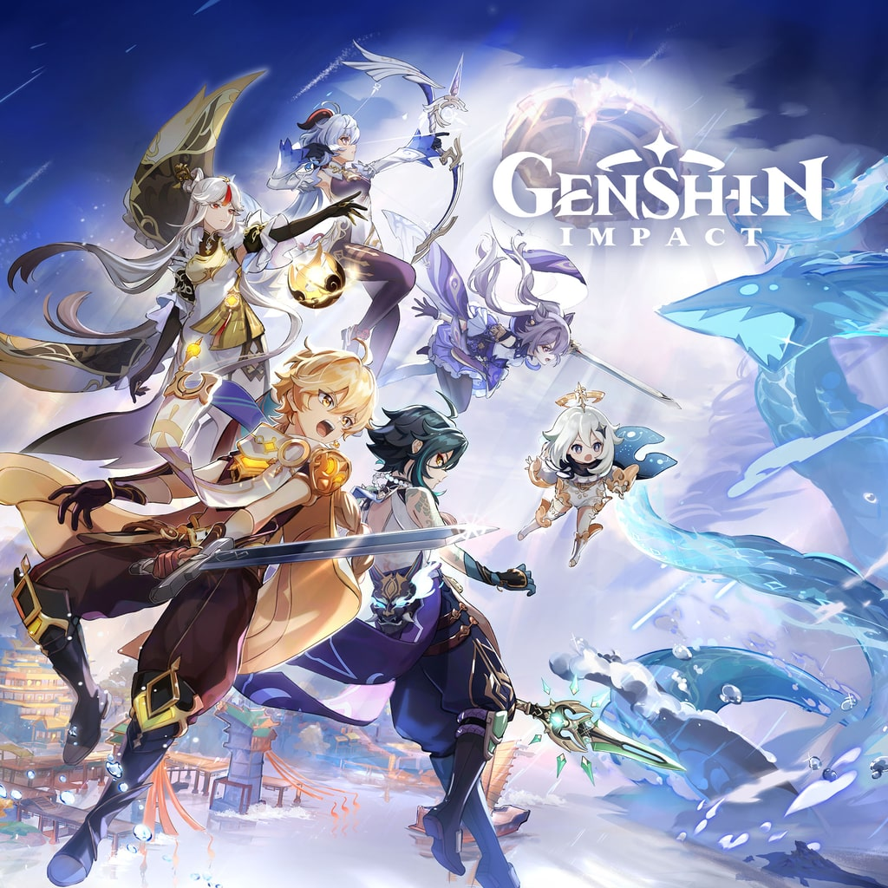
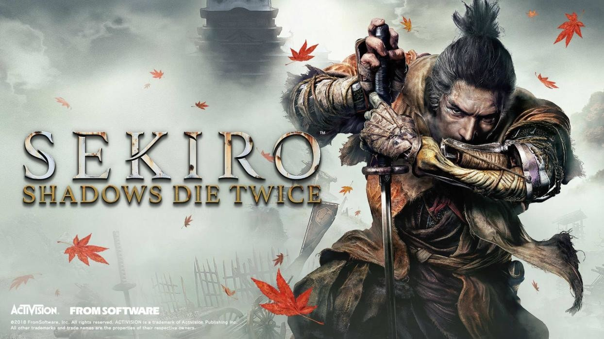
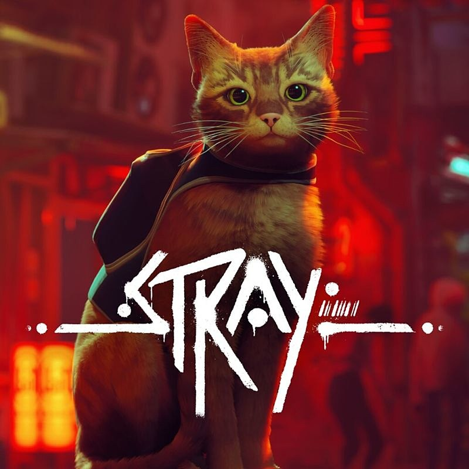
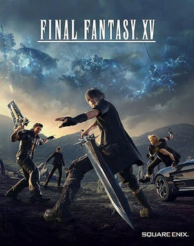

# VersionControl_Seminar3
Репозиторий для пулл-реквестов по Введению в контроль версий в Geekbrains

# Начальная работа с системой контроля версий 

* git --version - команда для проверки версии git

* git init - инициализируем пустой репозиторий

* git status - проверяем текущее состояние файлов

* git add имя_файла_с_расширением - добавляем версионность файлу 

* git add . - добавляем версионность всем файлам в папке

* git commit -m - команда для фиксации изменений файлов

* git commit -am - фиксация изменений, не требует git add .

* git diff - вывод изменений на текущий момент по отношению к последнему коммиту

* git log - вывод истории коммитов в хронологическом порядке

* git checkout хеш_коммита - переход между измененими 

* git checkout master - возврат к текущему состоянию

* для добавления картинки нужно ввести следующее:

* Для обозначения цитат используется знак «больше» >

* Чтобы добавть ссылку, необходимо написать следующее:
[название](сама ссылка)
[genshin](https://genshin.hoyoverse.com/ru/home)

# Что такое Git?

Git - это одна из реализаций распределенных систем контроля версий, имеющая как и локальные, так и удаленные репозитории. Является самой популярной реализацией систем контроля в мире.

## Подготовка репозитория

Для создания репозитория необходимо выполнить команду *git init*  в папке с репозиторием.

## Git add

Для добавления изменений в коммит используется команда *git add*, напишите *git add имя_файла* или *git add .*

## Создание коммитов

Для того, чтобы создать коммит (сохранение), необходимо выполнить команду *git commit -m "Сообщение"* или *git commit -am "Сообщение"*

## Создание ветки

Для того, чтобы создать ветку, нужно использовать *git branch имя_ветки* или *git checkout -b имя_ветки* (последняя команда еще и переместит в новую ветку)

## Git log

Чтобы посмотреть историю коммитов, нажмите *git log*. Если нужно кратко, то *git log --oneline*. Для отображения веток команда *git log --graph*.

## Слияние веток

Чтобы слить ветку в текущую, нажмите *git merge имя_ветки*

## Что такое Github?

GitHub — крупнейший веб-сервис для хостинга IT-проектов и их совместной разработки.

## Push and pull

1. Создали аккаунт на Github.com
2. Создать локальный репозиторий.
3. "Подружить" ваш локальный и удаленный репозитории. Github при создании нового репозитория подскажет как это сделать)
4. Отправить (push) ваш локальный репозиторий в удаленный (на Github), при этои вам, возможно, нужно будет авторизоваться на удаленном репозитории.
5. Провести изменения "с другого компьютера".
6. Выкачать (pull) актуальное состояние из удаленого репозитория.

## Fork

1. Делаем fork интересующего нас репозитория.
2. Мы делаем clone для нашей версии этого репозитория.
3. Создаем ветку с предлагаемыми изменениями.
4. Производим все изменения только в этой ветке.
5. Отправляем эти изменения на свой аккаунт (push).
6. В окне на Github появляется возможность отправть pull request.

## Genshin Impact

Genshin Impact — компьютерная игра в жанре action-adventure с открытым миром и элементами RPG, разработанная китайской компанией miHoYo Limited.

Действие Genshin Impact происходит в фэнтезийном мире Тейват, который является домом для семи различных народов, каждый из которых связан с отдельной стихией и управляется отдельным богом, Архонтом. Сюжет рассказывает о герое по имени Путешественник, который странствует по бесчисленным мирам со своим братом или же сестрой-близнецом (в зависимости от того, кого игрок выберет в начале игры), прежде чем разлучиться в Тейвате. Вместе со своей спутницей-компаньоном Паймон Путешественник отправляется на поиски своего потерянного близнеца, одновременно участвуя в делах народов Тейвата.

Музыка для Genshin Impact блыла написана Ю-Пэн Чэнем. Ю-Пэн Чэнь из HOYO-MiX сочинил оригинальную партитуру игры, которая была исполнена Лондонским филармоническим оркестром, Шанхайским симфоническим оркестром и Токийским филармоническим оркестром. Подход к созданию саундтрека заключался в том, чтобы погрузить игроков в мир игры и обеспечить эмоциональные и красивые мелодии. Основанная на фундаменте западной музыки, партитура также имеет региональные и культурные влияния, добавленные в зависимости от региона. 

## Sekiro: Shadows Die Twice

Sekiro: Shadows Die Twice — компьютерная игра в жанре Action-adventure, разработанная японской компанией FromSoftware и изданная Activision (издателем на территории Японии была сама FromSoftware). 

Sekiro: Shadows Die Twice представляет собой экшн-игру с видом от третьего лица; её действие происходит в феодальной Японии в период Сэнгоку. Под управлением игрока находится Волк, воин с костяной рукой, вооружённый мечом и верёвкой с крюком. Он находится на пути мести.

Музыка для Sekiro: Shadows Die Twice была написана композитором Юкой Китамурой. Ранее она работала над саундтреком для Dark Souls и Bloodborne. Действие игры происходит в вымышленной Японии периода Сэнгоку. Это был очень жестокий период конфликтов. Юка Китамура описывает атмосферу того периода, как «ужасное, заляпанное грязью и залитое кровью поле битвы. Но в тоже время там присутствует древняя японская красота и освященные веками традиции и религиозные аспекты, которые вошли в музыку».

## Stray

Stray — приключенческая компьютерная игра, разработанная студией BlueTwelve Studio и изданная компанией Annapurna Interactive. В игре рассказывается о бродячем коте, который попадает в мир, населённый роботами, и решает вернуться к своей семье.

Игра представляет собой приключенческую игру от третьего лица. В ней есть элементы открытого мира, а также упор, сделанный на атмосферу и искусство. Игрок, управляя рыжим котом, должен решать головоломки для того, чтобы продвигаться по сюжету, перемещая препятствия и перебираясь по платформам. Протагониста сопровождает дрон-спутник по имени B-12, который может помочь, переводя язык роботов и храня предметы, найденные по всему миру. 

Музыка в этой игре прекрасна.

## Final Fantasy XV

Final Fantasy XV - видеоигра в жанре ролевого боевика, разработанная Square Enix. 

Final Fantasy XV не связана с предыдущими играми серии Final Fantasy. Сюжет фокусируется на молодом человеке по имени Ноктис Люцис Кэлум, наследном принце государства Люцис, где хранится последний оставшийся в мире таинственный магический кристалл. В начале игры кристалл обманом похищается вторгшейся враждебной нацией Нифльхейм, из-за чего начинается глобальный конфликт с другими народами, которые желают получить кристалл. Ноктис и его ближайшие друзья отправляются в путешествие, чтобы попытаться вернуть потерянную магическую реликвию.

Музыка для видеоигры Final Fantasy XV, разработанная и изданная Square Enix, была написана в основном Йоко Шимомурой. Final Fantasy XV, ранее работавшая над серией Kingdom Hearts, стала ее первым проектом в этой серии. Шимомура была привлечена к участию в проекте в 2006 году, Ее музыка, основанная на темах «дружбы» и «сыновних уз», включает в себя несколько музыкальных жанров, таких как оркестровая, босса-нова и американский блюз. Несколько треков, в том числе основная тема «Somnus», содержат тексты на латыни, написанные первоначальным директором игры.

