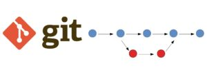
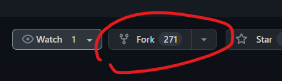

Команды >>> 
======

### Инициализация:

*`git version`* - команда проверки версии git

*`git init`* - инициализация пустого репозитория 

*`git status`* - проверка текущего состояния файла

*`git add имя_файла`* - добавление версионности файлу

*`git add .`* - добавление версионности **всем файлам** в текущей папке
#

### Коммиты:

*`git commit -m "название коммита"`* - команда для фиксации изменившихся файлов 

*`git commit -am "название коммита"`* - команда для фиксации изменившихся **неновых** файлов 

*`git log`* - вывод истории коммитов в хронологическом порядке. 

*`git diff`* - вывод измененний на текущий момент по отношению к текущему коммиту

*`git checkout хэш_коммита`* - перейти к указанному коммиту

*`git checkout имя_ветки`* - перейти к текущему состоянию ветки *имя_ветки*
#

### Ветвления:

*`git branch имя_ветки`* - добавление ветки

*`git checkout имя_ветки`* - переход на ветку
> *`git checkout -b имя_ветки`* - добавление ветки и переход на неё

*`git merge имя_ветки`* - слияние ветки с той, в которой находимся

*`git branch -d имя_ветки`* - удаление ветки

Интересный [тренер для команд git](https://learngitbranching.js.org/?locale=ru_RU "перейти на learngitbranching.js.org")
#

## Работа с удалённым репозиторием

*`git clone адрес_репозитроия`* - клонировать репозиторий в локальную папку

>*`git remote add origin адрес_репозитроия`* - подключение к удалённому репозиторию

>*`git branch -M main`* - переименовывание текущей (master) ветки в main

>*`git push -u origin main`* - отправка локалного репозитория на удалённый

*`git push адрес_репозитроия`* - отправить изменения с локального репозитория на удалённый

*`git pull адрес_репозитроия`* - "стянуть" изменения с удалённого репозитория

## Pullrequests

### __*`FORK`* - вилка - ответвление от текущего репозитория__
#

1. Прожимем в интересуещем нас репозитории *"Fork"*. При этом в списке наших репозитрориев появляется репозиторий с аналогичным названием.

2. Используя `git clone` клонируем форкнутый репо себе в локальный репозиторий

3. С помощью `git chekout` создаём ветку в форке, чтобы по правилам хорошего тона не кидать *request* в существующую ветку

4. Поработав, пушим (`git push`) в свой удалённый репозиторий 