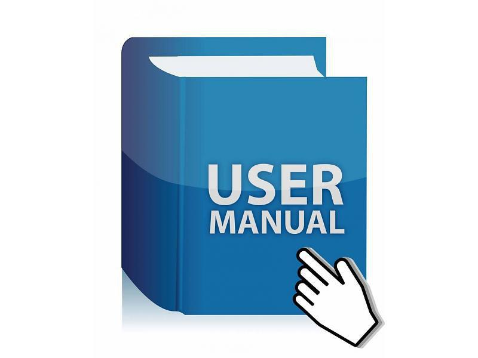

# Инструкция по работе с Git

## Начальная работа с системой контроля версий 

*git --version* - команда для проверки версии git

*git init* - инициализируем пустой репозиторий

*git status* - проверяем текущее состояние файлов

*git add* - добавляем версионность файлу

*git commit -m "message"* - команда для фиксации изменений файла

*git log* - вывод истории коммитов в хронологическом порядке

*git diff* - вывод изменений

*git checkout master либо хэш-номер коммита* - переход между изменениями, либо возврат к текущему состоянию

*git show хэш-номер коммита* - посмотреть полный список изменений, внесенных конкретным коммитом
### Для просмотра расширенного списка команд перейдите по ссылке:
[https://proglib.io/p/git-cheatsheet] 

>Наличие правильного руководства в нужное время имеет решающее значение для успеха.

## Работа с ветками

**_Создание ветки_**

Для того, чтобы создать ветку, нужно использовать *git branch <имя ветки>* или *git checkout -b <имя ветки>*.

**_Переход на другую ветку_**

Для того, чтобы перейти на другую ветку, нужно использовать *git checkout <имя ветки>*.

**_Слияние веток_**

Для того, чтобы слить 2 ветки, необходимо перейти в ветку, в которую будет происходить слияние и использовать *git merge <имя ветки, которую будем сливать>*

**_Удаление веток_**

Для того, чтобы удалить ненужную ветку, необходимо использовать *git branch -d <имя ветки, которую необходимо удалить>*
